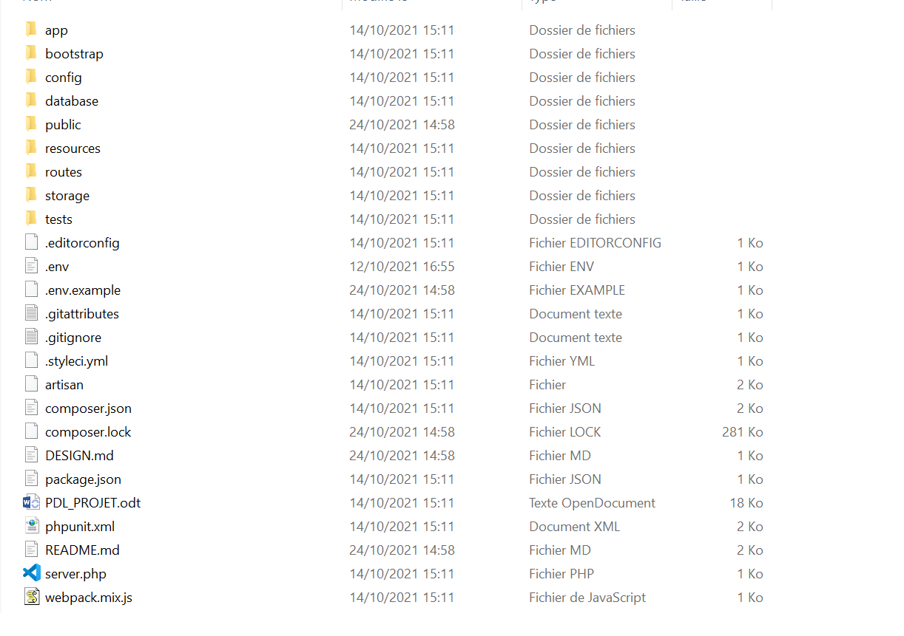
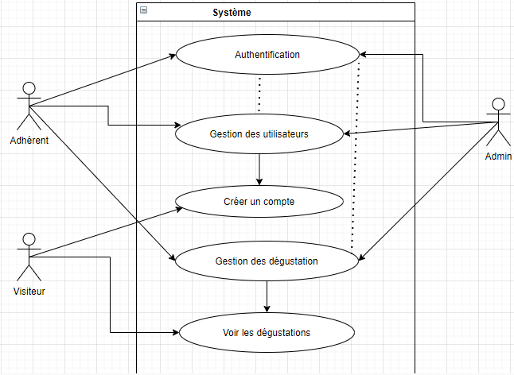
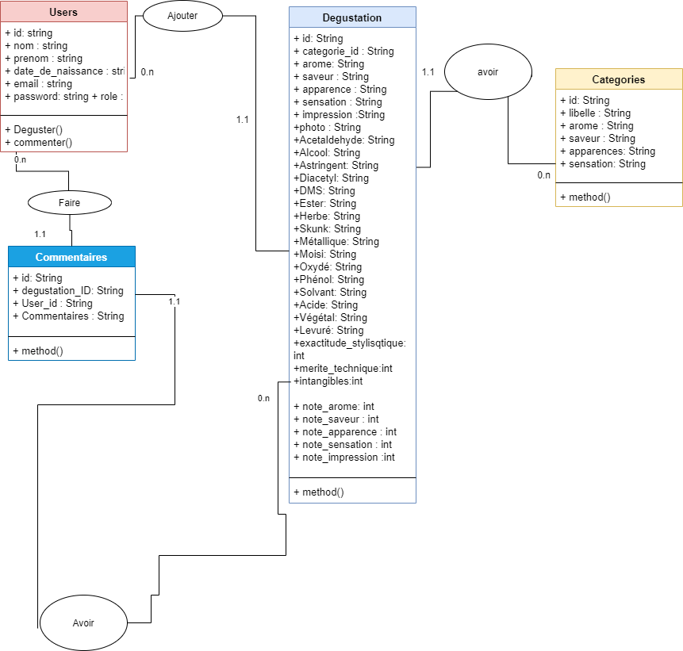

# Architecture de "Deguste APP"

Le Projet est basé sur une Architecture MVC (Modèle Vue Contrôleur).

## Organisation des packages

DEGUST APP est une application basée sur la structure que fournir le framework laravel.
Laravel est un framework web open-source écrit en PHP, respectant le principe
modèle-vue-contrôleur et entièrement développé en programmation orientée objet.
Il est distribué sous licence MIT, avec ses sources hébergées sur GitHub.
Laravel fournit un outil de ligne de commande intégré appelé Artisan.

Cet outil aide à la création d'une architecture de code « squelette » 
et de base de données, ainsi que leurs migrations.
Laravel permet à un développeur de tirer parti d’une vaste bibliothèque de fonctionnalités
préprogrammées (telles que l’authentification, le routage et la création de modèles HTML). 
L’accès à cette bibliothèque simplifie la création rapide d’applications web robustes,
tout en minimisant la quantité de code nécessaire.

## Descriptions des classes principales

En plus des classes fourni par le framework laravel, nous disposerons de 
plusieurs classes :
      
### Au niveau des contrôleurs nous avons 

CathegorieControllers: est une classe qui permet de manipuler les données de la table 
catégorie de notre base de données et des différentes vues qui voudrons l'utiliser.
De même pour les autres classes tels que CommentaireController, DegustationController 
et UserController. 

Toutes ces classes hérite de la classe Controller du framework laravel

### Au niveau des modèles nous avons les classes suivantes 

Catégorie, Commentaire, Dégustation et Users qui hérite de la classe modèle 
du framework laravel. Ces classes nous permettrons de communiquer directement 
avec notre base de données et nos différents contrôleurs.
La classe modèle du framework laravel nous permet de faire des opérations de base 
tel que : les requêtes d'insertion, update, selecte et delete à travers des fonctions 
simples à utiliser.

### Connexion à la base de données

Grâce à la configuration interne de laravel, la connexion à la base de donnée 
devient très simple.

### Au niveau de la vue

Grâce à la structure MVC sur lequel repose laravel, nos différentes vue seront 
ranger dans le dossier ressource/views/, cela permettra de faciliter l'organisation 
de nos différents fichiers. Plus d'information sur la documentation de laravel.

 
## Architecture back-end

L'architecture back-end repose sur la structure et l'organisation que propose 
le framework laravel

### Cas d'utilisation

## Architecture de la BDD

### Diagramme de classe

Le diagramme de classe nous permet de visualiser notre base de données 

## Architecture du front-end

Notre application du coté front-end sera basée sur l'architecture du framework 
laravel blade et de bootstrap.

Notre application aura deux grandes parties.

La première partie est la plateforme d'entrée. Elle permettra à n'importe quel 
visiteur de voir la liste des dégustations effectuées par les différents membres 
inscrits et voir les commentaires effectués sur une dégustation.
Si le visiteur souhaite effectuer un commentaire ou enregistrer une dégustation, 
il devra s'inscrire, dans le cas où il ne disposerait pas d'un compte sur notre 
application, mais dans le cas contraire, il devra s'authentifier.

La deuxième partie est consacrée au membre. Ils pourront faire une ou plusieurs 
dégustations, commenter, consulter une ou plusieurs dégustations.

Quelque capture d'écran pour montrer comment notre application sera présentée :

 ### • Vue coté visiteur

 ### • Vue coté membre

